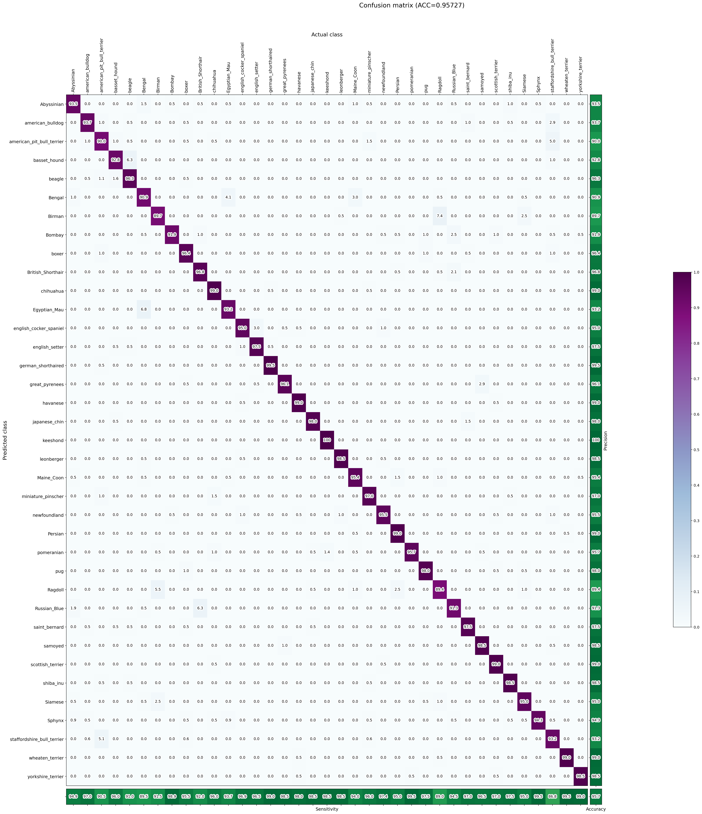
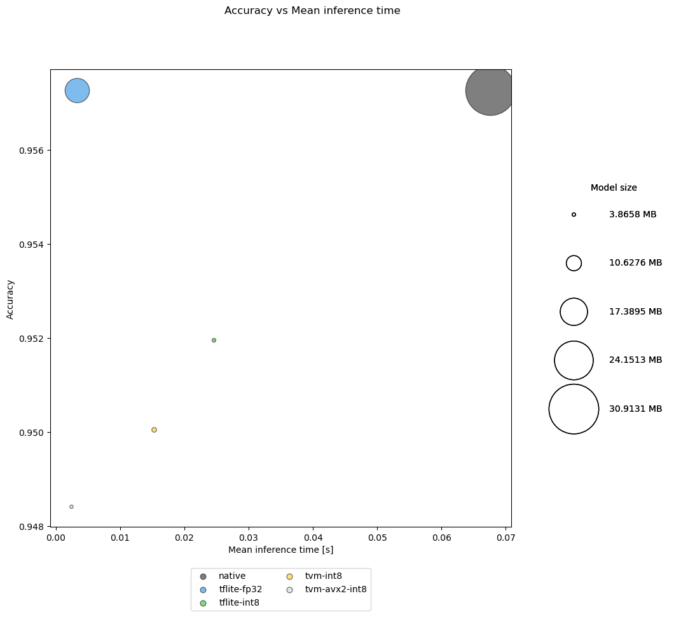
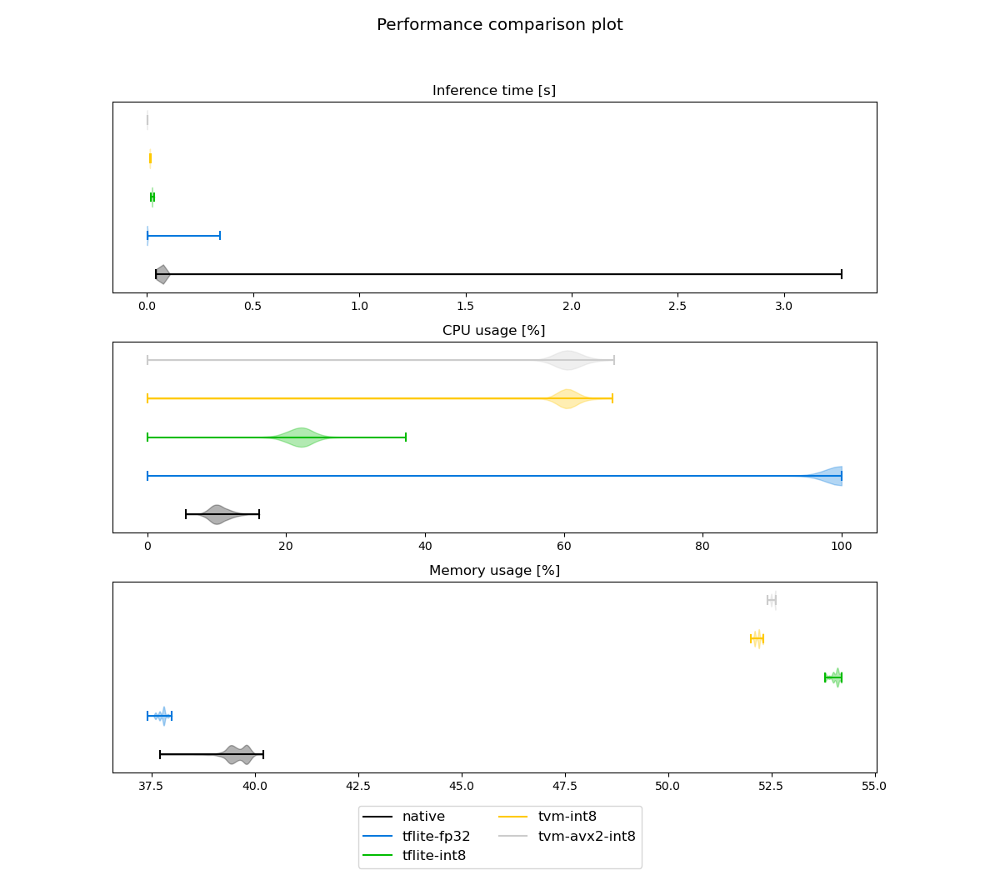
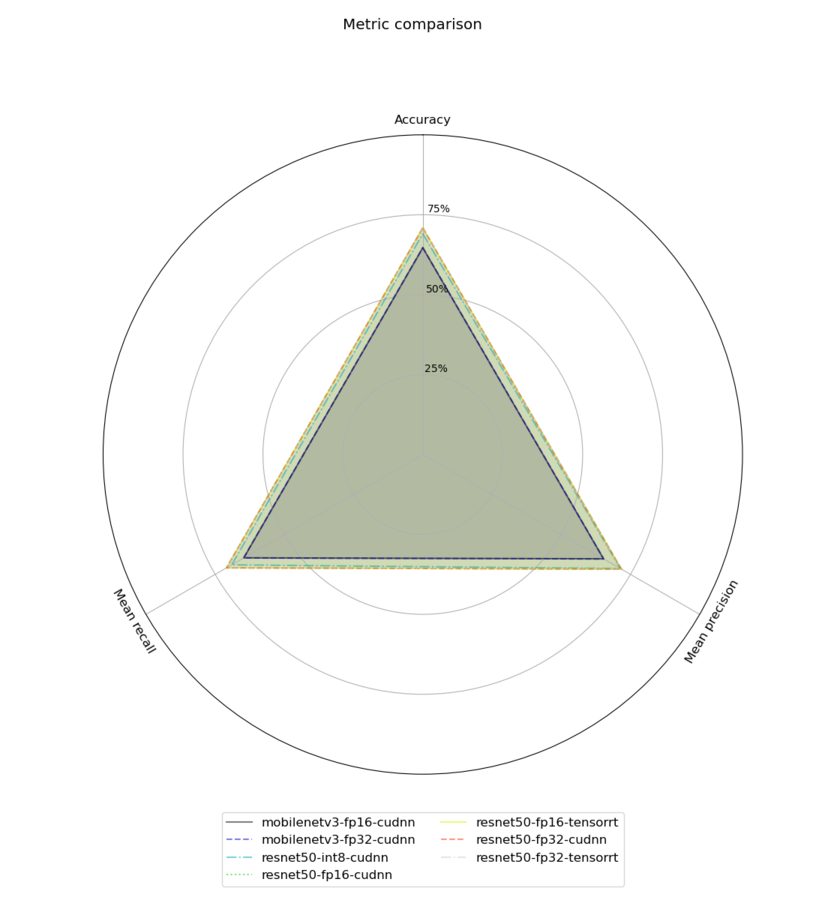

# Kenning

Copyright (c) 2020-2023 [Antmicro](https://www.antmicro.com)


Kenning is a framework for creating deployment flows and runtimes for Deep Neural Network applications on various target hardware.

[Kenning documentation](https://antmicro.github.io/kenning/) | [Core API](https://antmicro.github.io/kenning/kenning-api.html) | [kenning.ai](https://opensource.antmicro.com/projects/kenning)


Contents:

* [Introduction](#introduction)
* [Kenning installation](#kenning-installation)
* [Kenning structure](#kenning-structure)
* [Kenning usage](#kenning-usage)
* [Example use case of Kenning](#example-use-case-of-kenning)
* [Using Kenning as a library in Python scripts](#using-kenning-as-a-library-in-python-scripts)
* [Inspecting Kenning modules from CLI](#inspecting-kenning-modules-from-cli)
* [Adding new implementations](#adding-new-implementations)

## Introduction

Kenning aims towards providing modular execution blocks for:

* dataset management,
* model training,
* model optimization and compilation for a given target hardware,
* running models using efficient runtimes on target device,
* model evaluation and performance reports.

These can be used seamlessly regardless of underlying frameworks for the above-mentioned steps.

Kenning's aim is not to bring yet another training or compilation framework for deep learning models - there are lots of mature and versatile frameworks that support certain models, training routines, optimization techniques, hardware platforms and other components crucial to the deployment flow.
Still, there is no framework that would support all of the models or target hardware devices - especially the support matrix between compilation frameworks and target hardware is extremely sparse.
This means that any change in the application, especially in hardware, may end up in a necessity to change the entirety or a significant part of the application flow.

Kenning addresses this issue by providing a unified API that focuses on deployment tasks rather than their implementation - the developer decides which implementation should be used for each task, and with Kenning, it is possible to do in a seamless way.
This way, switching to another target platform results, in most cases, in a very small change in the code, instead of reimplementing larger parts of a project.
This is how Kenning can get the most out of the existing Deep Neural Network training and compilation frameworks.

Seamless nature of Kenning also allows developers to quickly evaluate the model on various stages of optimizations and compare them as shown in [Example use case of Kenning](#example-use-case-of-kenning).

## Kenning installation

### Module installation with pip

To install Kenning with its basic dependencies with `pip`, run:

```bash
pip install -U git+https://github.com/antmicro/kenning.git
```

Since Kenning can support various frameworks, and not all of them are required for users' particular use cases, some of the requirements are optional.
We can distinguish the following groups of extra requirements:

* `tensorflow` - modules for work with TensorFlow models (ONNX conversions, addons, and TensorFlow framework),
* `torch` - modules for work with PyTorch models,
* `mxnet` - modules for work with MXNet models,
* `nvidia_perf` - modules for performance measurements for NVIDIA GPUs,
* `object_detection` - modules for work with YOLOv3 object detection and the Open Images Dataset V6 computer vision dataset,
* `speech_to_text` - modules for work with audio samples and speech-to-text models,
* `iree` - modules for IREE compilation and runtime,
* `tvm` - modules for Apache TVM compilation and runtime,
* `onnxruntime` - modules for ONNX Runtime,
* `nni` - modules for Neural Network Intelligence optimizers,
* `docs` - modules for generating documentation,
* `test` - modules for Kenning framework testing,
* `real_time_visualization` - modules for real time visualization runners,
* `pipeline_manager` - modules for communication with visual editor,
* `reports` - modules for generating reports and comparisons,
* `uart` - modules for work with serial ports,
* `renode` - modules for work with Renode,
* `fuzzy` - modules for fuzzy search.

To install the extra requirements, e.g. `tensorflow`, run:

```bash
sudo pip install git+https://github.com/antmicro/kenning.git#egg=kenning[tensorflow]
```

or, in newer `pip` releases:

```bash
pip install "kenning[tensorflow,reports,tvm] @ git+https://github.com/antmicro/kenning.git"
```

### Working directly with the repository

For development purposes, and to use additional resources (such as sample scripts), clone the repository with:

```bash
git clone https://github.com/antmicro/kenning.git
cd kenning/
```

Then install using:

```bash
pip install -e ".[tensorflow,reports,tvm]"
```

## Kenning structure


The `kenning` module consists of the following submodules:

* `core` - provides interface APIs for datasets, models, optimizers, runtimes and runtime protocols,
* `datasets` - provides implementations for datasets,
* `modelwrappers` - provides implementations for models for various problems implemented in various frameworks,
* `optimizers` - provides implementations for compilers and optimizers for deep learning models,
* `runtimes` - provides implementations of runtime on target devices,
* `interfaces` - provides interface classes to group related methods used in Kenning `core` classes,
* `runtimeprotocols` - provides implementations for communication protocols between host and tested target,
* `dataproviders` - provides implementations for reading input data from various sources, such as camera, directories or TCP connections,
* `outputcollectors` - provides implementations for processing outputs from models, i.e. saving results to file, or displaying predictions on screen.
* `onnxconverters` - provides ONNX conversions for a given framework along with a list of models to test the conversion on,
* `runners` - provide implementations for runners that can be used in runtime,
* `drawing` - provides methods for rendering plots for reports,
* `resources` - contains project's resources, like RST templates, or trained models,
* `scenarios` - contains executable scripts for running training, inference, benchmarks and other tests on target devices,
* `utils` - various functions and classes used in all above-mentioned submodules,
* `tests` - submodules for framework testing,
* `pipeline_manager` - contains tools for integrating with [Pipeline Manager visualizer](https://github.com/antmicro/kenning-pipeline-manager)
* `cli` - provides tools and methods for creating CLI tools based on Kenning

`core` classes used throughout the entire Kenning framework:

* `Dataset` class - performs dataset download, preparation, dataset-specific input preprocessing (i.e. input file opening, normalization), output postprocessing and model evaluation,
* `ModelWrapper` class - trains the model, prepares the model, performs model-specific input preprocessing and output postprocessing, runs inference on host using native framework,
* `Optimizer` class - optimizes and compiles the model,
* `Runtime` class - loads the model, performs inference on compiled model, runs target-specific processing of inputs and outputs, and runs performance benchmarks,
* `RuntimeProtocol` class - implements the communication protocol between the host and the target,
* `DataProvider` class - implements data provision from such sources as camera, TCP connection or others for inference,
* `OutputCollector` class - implements parsing and utilization of data from inference (such as displaying the visualizations, sending the results to via TCP),
* `Runner` class - represents single runtime processing block.

## Kenning usage

There are several ways to use Kenning:

* Using executable scripts from the `scenarios` submodule, configurable via JSON files (recommended approach);
* Using executable scripts from the `scenarios` submodule, configurable via command-line arguments;
* Using Kenning as a Python module.

Kenning scenarios are executable scripts for:

* Model training and benchmarking using its native framework ([`kenning.scenarios.model_training`](https://github.com/antmicro/kenning/blob/main/kenning/scenarios/model_training.py)),
* Model optimization and compilation for target hardware ([`kenning.scenarios.inference_tester`](https://github.com/antmicro/kenning/blob/main/kenning/scenarios/inference_tester.py)),
* Model benchmarking on target hardware ([`kenning.scenarios.inference_tester`](https://github.com/antmicro/kenning/blob/main/kenning/scenarios/inference_tester.py) and [`kenning.scenarios.inference_server`](https://github.com/antmicro/kenning/blob/main/kenning/scenarios/inference_server.py)),
* Rendering performance and quality reports from benchmark data ([`kenning.scenarios.render_report`](https://github.com/antmicro/kenning/blob/main/kenning/scenarios/render_report.py)),
* and more.

You can access these scenarios directly using e.g.:

```bash
python -m kenning.scenarios.inference_tester -h
```

You can also access them through the `kenning` executable as subcommands.
To get the current list of subcommands, run:

```bash
kenning -h
```

The available subcommands are:

* `train` - trains the given model (`kenning.scenarios.model_training`).
* `optimize` - optimizes and compiles the model for a given target device (`kenning.scenarios.inference_tester`).
* `test` - runs benchmark and evaluation of the model on the target device (`kenning.scenarios.inference_tester`).
* `report` - creates Markdown and HTML files summarizing the quality of the model in terms of performance and predictions.
* `flow` - runs Kenning-based applications.
* `visual-editor` - runs a graphical interface letting you represent, edit and run optimizations and applications in-browser using [Pipeline Manager](https://github.com/antmicro/kenning-pipeline-manager).
* `fine-tune-optimizers` - runs a search for the best optimizations for a given target platform based on selected optimizers, runtimes and models, along with their settings.
* `server` - runs a benchmark and evaluation server on target device.
* `info` - provides information about a given Kenning class.
* `list` - lists available Kenning modules for optimization and runtime.
* `fuzzy-search` - searches for class path across Kenning and returns it.
* `cache` - manages Kenning cache used for models and datasets.
* `completion` - configures autocompletion feature for Kenning CLI.

Kenning also provides autocompletion for the CLI, which has to be configured separately with `kenning completion`.

For more details on each of the above scenarios, see the [Kenning documentation](https://antmicro.github.io/kenning/).

## Example use case of Kenning

Let's consider a simple scenario, where we want to optimize the inference time and memory usage of the classification model executed on a x86 CPU.

For this, we are going to use the [`PetDataset`](https://github.com/antmicro/kenning/blob/main/kenning/datasets/pet_dataset.py) Dataset and the [`TensorFlowPetDatasetMobileNetV2`](https://github.com/antmicro/kenning/blob/main/kenning/modelwrappers/classification/tensorflow_pet_dataset.py) ModelWrapper.

We will skip the training process - we will use [tensorflow_pet_dataset_mobilenetv2.h5](https://dl.antmicro.com/kenning/models/classification/tensorflow_pet_dataset_mobilenetv2.h5).
In Kenning, available models and resources can be downloaded using URIs with the `kenning://` scheme, in this case `kenning:///models/classification/tensorflow_pet_dataset_mobilenetv2.h5`.

The training of the above model can be performed using the following command:

```bash
kenning train \
    --modelwrapper-cls kenning.modelwrappers.classification.tensorflow_pet_dataset.TensorFlowPetDatasetMobileNetV2 \
    --dataset-cls kenning.datasets.pet_dataset.PetDataset \
    --logdir build/logs \
    --dataset-root build/pet-dataset \
    --model-path build/trained-model.h5 \
    --batch-size 32 \
    --learning-rate 0.0001 \
    --num-epochs 50
```

### Benchmarking a model using a native framework

First of all, we want to check how the trained model performs using the native framework on CPU.

For this, we will use the `inference_tester` scenario.
Scenarios are configured using JSON format files.
In our case, the JSON file (named `native.json`) will look like this:

```json
{
    "model_wrapper":
    {
        "type": "kenning.modelwrappers.classification.tensorflow_pet_dataset.TensorFlowPetDatasetMobileNetV2",
        "parameters":
        {
            "model_path": "kenning:///models/classification/tensorflow_pet_dataset_mobilenetv2.h5"
        }
    },
    "dataset":
    {
        "type": "kenning.datasets.pet_dataset.PetDataset",
        "parameters":
        {
            "dataset_root": "./build/pet-dataset"
        }
    },
    "model_name": "native"
}
```

This JSON provides a configuration for running the model natively and evaluating it against a defined Dataset.

For every class in the above JSON file, there are two keys required: `type` which is a module path of our class and `parameters` which is used to provide arguments used to create the instances of our classes.

In `model_wrapper`, we specify the model used for evaluation - here it is MobileNetV2 trained on Pet Dataset. The `model_path` is the path to the saved model.
The `TensorFlowPetDatasetMobileNetV2` model wrapper provides methods for loading the model, preprocessing the inputs, postprocessing the outputs and running inference using the native framework (TensorFlow in this case).

The dataset provided for evaluation is Pet Dataset - here we specify that we want to download the dataset to the `./build/pet-dataset` directory (`dataset_root`).
The `PetDataset` class can download the dataset (if necessary), load it, read the inputs and outputs from files, process them, and implement evaluation methods for the model.

With the above config saved in the `native.json` file, run the `inference_tester` scenario:

```bash
kenning test --json-cfg native.json --measurements build/native.json
```

This module runs inference based on the given configuration, evaluates the model and stores quality and performance metrics in JSON format, saved to the `build/native.json` file.
All other JSONs in this example use case can be executed with this command.

To visualize the evaluation and benchmark results, run the `render_report` module:

```bash
kenning report --report-path build/benchmarks/native.md --measurements build/native.json --root-dir build/benchmarks --img-dir build/benchmarks/imgs --report-types performance classification --report-name 'native'
```

Or use the simplified command:

```bash
kenning report --report-path build/benchmarks/native.md --measurements build/native.json
```

Moreover, all these commands can be reduced to a single `kenning` run:

```bash
kenning test report --json-cfg native.json --measurements build/native.json --report-path build/benchmarks/native.md
```

This module takes the output JSON file generated by the `inference_tester` module, and creates a report titled `native`, which is saved in the `build/benchmarks/native.md` directory.
As specified in the `--report-types` flag, we create `performance` and `classification` metrics sections in the report (for example, there is also a `detection` report type for object detection tasks).

In `build/benchmarks/imgs` there will be images with the `native_*` prefix visualizing the confusion matrix, CPU and memory usage, as well as inference time.

The `build/benchmarks/native.md` file is a Markdown document containing a full report for the model - apart from linking to the generated visualizations, it provides aggregated information about CPU and memory usage, as well as classification quality metrics, such as accuracy, sensitivity, precision or G-Mean.
Such file can be included in a larger, Sphinx-based documentation, which allows easy, automated report generation, using e.g. CI, as can be seen in the [Kenning documentation](https://antmicro.github.io/kenning/sample-report.html).

While native frameworks are great for training and inference, model design, training on GPUs and distributing training across many devices, e.g. in a cloud environment, there is a fairly large variety of inference-focused frameworks for production purposes that focus on getting the most out of hardware in order to get results as fast as possible.

### Optimizing a model using TensorFlow Lite

One of such frameworks is TensorFlow Lite - a lightweight library for inferring networks on edge - it has a small binary size (which can be even more reduced by disabling unused operators) and a highly optimized format of input models, called FlatBuffers.

Before the TensorFlow Lite Interpreter (runtime for the TensorFlow Lite library) can be used, the model first needs to be optimized and compiled to the `.tflite` format.

Let's add a TensorFlow Lite Optimizer that will convert our MobileNetV2 model to a FlatBuffer format, as well as TensorFlow Lite Runtime that will execute the model:

```json
{
    "model_wrapper":
    {
        "type": "kenning.modelwrappers.classification.tensorflow_pet_dataset.TensorFlowPetDatasetMobileNetV2",
        "parameters":
        {
            "model_path": "kenning:///models/classification/tensorflow_pet_dataset_mobilenetv2.h5"
        }
    },
    "dataset":
    {
        "type": "kenning.datasets.pet_dataset.PetDataset",
        "parameters":
        {
            "dataset_root": "./build/pet-dataset"
        }
    },
    "optimizers":
    [
        {
            "type": "kenning.optimizers.tflite.TFLiteCompiler",
            "parameters":
            {
                "target": "default",
                "compiled_model_path": "./build/fp32.tflite",
                "inference_input_type": "float32",
                "inference_output_type": "float32"
            }
        }
    ],
    "runtime":
    {
        "type": "kenning.runtimes.tflite.TFLiteRuntime",
        "parameters":
        {
            "save_model_path": "./build/fp32.tflite"
        }
    },
    "model_name": "tflite-fp32"
}
```

The configuration of the already existing blocks has not changed - the dataset will not be downloaded again though, since the files are already present.

The first new addition is the presence of the `optimizers` list - it allows us to add one or more objects inheriting from the `kenning.core.optimizer.Optimizer` class.
Optimizers read the model from the input file, apply various optimizations, and then save the optimized model to a new file.

In our current scenario, we will use the `TFLiteCompiler` class - it reads the model in a Keras-specific format, optimizes the model and saves it to the `./build/fp32.tflite` file.
The parameters of this particular Optimizer are worth noting here (each Optimizer usually has a different set of parameters):

* `target` - indicates what the desired target device (or model type) is, `default` is the regular CPU. Another example here could be `edgetpu`, which can compile models for the Google Coral platform.
* `compiled_model_path` - indicates where the model should be saved.
* `inference_input_type` and `inference_output_type` - indicate what the input and output type of the model should be. Usually, all trained models use FP32 weights (32-bit floating point) and activations - using `float32` here keeps the weights unchanged.

The second thing that is added to the previous flow is the `runtime` block - it provides a class inheriting from the `kenning.core.runtime.Runtime` class that is able to load the final model and run inference on target hardware. Usually, each `Optimizer` has a corresponding `Runtime` able to run its results.

To compile the scenario (called `tflite-fp32.json`), run:

```bash
kenning optimize test report --json-cfg tflite-fp32.json --measurements build/tflite-fp32.json --report-path build/benchmarks/tflite-fp32.md
```

While it depends on the platform used, there should be a significant improvement in both inference time (model ca. 10-15x faster model compared to the native model) and memory usage (output model ca. 2x smaller).
What’s worth noting is that we get a significant improvement with no harm to the quality of the model - the outputs stay the same.



### Quantizing a model using TensorFlow Lite

To further reduce memory usage, we can quantize the model - it is a process where all weights and activations in a model are calibrated to work with the `INT8` precision, instead of the `FP32` precision.
While it may severely harm the quality of the predictions, the quality reduction can be negligible with proper calibration.

The model can be quantized during the compilation process in TensorFlow Lite.
With Kenning, it can be achieved with the following simple additions:

```json
{
    "model_wrapper":
    {
        "type": "kenning.modelwrappers.classification.tensorflow_pet_dataset.TensorFlowPetDatasetMobileNetV2",
        "parameters":
        {
            "model_path": "kenning:///models/classification/tensorflow_pet_dataset_mobilenetv2.h5"
        }
    },
    "dataset":
    {
        "type": "kenning.datasets.pet_dataset.PetDataset",
        "parameters":
        {
            "dataset_root": "./build/pet-dataset"
        }
    },
    "optimizers":
    [
        {
            "type": "kenning.optimizers.tflite.TFLiteCompiler",
            "parameters":
            {
                "target": "int8",
                "compiled_model_path": "./build/int8.tflite",
                "inference_input_type": "int8",
                "inference_output_type": "int8"
            }
        }
    ],
    "runtime":
    {
        "type": "kenning.runtimes.tflite.TFLiteRuntime",
        "parameters":
        {
            "save_model_path": "./build/int8.tflite"
        }
    },
    "model_name": "tflite-int8"
}
```

The only changes here in comparison to the previous configuration appear in the `TFLiteCompiler` configuration - we change `target`, `inference_input_type` and `inference_output_type` to `int8`.
Then, in the background, `TFLiteCompiler` fetches a subset of images from the `PetDataset` object to calibrate the model, and so the entire model calibration process happens automatically.

Let's run the above scenario (`tflite-int8.json`):

```bash
kenning optimize test report --json-cfg tflite-int8.json --measurements build/tflite-int8.json --report-path build/benchmarks/tflite-int8.md
```

This results in a model over 7 times smaller compared to the native model without significant loss of accuracy, but without speed improvement.

### Speeding up inference with Apache TVM

To speed up inference of a quantized model, we can utilize vector extensions in x86 CPUs, more specifically AVX2.
For this, let's use the Apache TVM framework to compile efficient runtimes for various hardware platforms.
The scenario looks like this:

```json
{
    "model_wrapper":
    {
        "type": "kenning.modelwrappers.classification.tensorflow_pet_dataset.TensorFlowPetDatasetMobileNetV2",
        "parameters":
        {
            "model_path": "kenning:///models/classification/tensorflow_pet_dataset_mobilenetv2.h5"
        }
    },
    "dataset":
    {
        "type": "kenning.datasets.pet_dataset.PetDataset",
        "parameters":
        {
            "dataset_root": "./build/pet-dataset"
        }
    },
    "optimizers":
    [
        {
            "type": "kenning.optimizers.tflite.TFLiteCompiler",
            "parameters":
            {
                "target": "int8",
                "compiled_model_path": "./build/int8.tflite",
                "inference_input_type": "int8",
                "inference_output_type": "int8"
            }
        },
        {
            "type": "kenning.optimizers.tvm.TVMCompiler",
            "parameters": {
                "target": "llvm -mcpu=core-avx2",
                "opt_level": 3,
                "conv2d_data_layout": "NCHW",
                "compiled_model_path": "./build/int8_tvm.tar"
            }
        }
    ],
    "runtime":
    {
        "type": "kenning.runtimes.tvm.TVMRuntime",
        "parameters":
        {
            "save_model_path": "./build/int8_tvm.tar"
        }
    },
    "model_name": "tvm-avx2-int8"
}
```

As it can be observed, addition of a new framework is just a matter of simply adding and configuring another optimizer and using the corresponding `Runtime` to the final `Optimizer`.

The `TVMCompiler`, with `llvm -mcpu=core-avx2` as the target, optimizes and compiles the model to use vector extensions. The final result is a `.tar` file containing a shared library that implements the entire model.

Let's compile the scenario (`tvm-avx2-int8.json`):

```bash
kenning optimize test report --json-cfg tvm-avx2-int8.json --measurements build/tvm-avx2-int8.json --report-path build/benchmarks/tvm-avx2-int8.md
```

This results in a model over 40 times faster compared to the  native implementation, with size reduced 3x.

This shows how easily we can interconnect various frameworks and get the most out of the hardware using Kenning, while performing just minor alterations to the configuration file.

The summary of passes can be seen below:

|               | Speed boost | Accuracy     | Size reduction  |
|---------------|-------------|--------------|-----------------|
| native        |           1 | 0.9572730984 |               1 |
| tflite-fp32   | 15.79405698 | 0.9572730984 |     1.965973551 |
| tflite-int8   | 1.683232669 | 0.9519662539 |      7.02033412 |
| tvm-avx2-int8 | 41.61514549 | 0.9487005035 |     3.229375069 |

### Automated model comparison

The `kenning.scenarios.render_report` script also allows us to compare evaluation results for multiple models.
Apart from creating a table with a summary of models, it also creates plots aggregating measurements collected during the evaluation process.

To create a comparison report for the above experiments, run:

```bash
kenning report \
    --report-path build/benchmarks/summary.md \
    --measurements \
        build/native.json \
        build/tflite-fp32.json \
        build/tflite-int8.json \
        build/tvm-avx2-int8.json
```

Some examples of comparisons between various models rendered with the script:

* Accuracy, inference time and model size comparison:

  
* Resource utilization distribution:

  
* Comparison of classification metrics:

  
* And more

## Using Kenning as a library in Python scripts

Kenning is also a regular Python module - after pip installation it can be used in Python scripts.
The example compilation of the model can look as follows:

```python
from kenning.datasets.pet_dataset import PetDataset
from kenning.modelwrappers.classification.tensorflow_pet_dataset import TensorFlowPetDatasetMobileNetV2
from kenning.optimizers.tflite import TFLiteCompiler
from kenning.runtimes.tflite import TFLiteRuntime
from kenning.core.measurements import MeasurementsCollector

dataset = PetDataset(
    root='./build/pet-dataset/'
)
model = TensorFlowPetDatasetMobileNetV2(
    modelpath='kenning:///models/classification/tensorflow_pet_dataset_mobilenetv2.h5',
    dataset=dataset
)
model.save_io_specification(model.modelpath)
compiler = TFLiteCompiler(
    dataset=dataset,
    compiled_model_path='./build/compiled-model.tflite',
    modelframework='keras',
    target='default',
    inferenceinputtype='float32',
    inferenceoutputtype='float32'
)
compiler.compile(
    inputmodelpath='kenning:///models/classification/tensorflow_pet_dataset_mobilenetv2.h5'
)
```

The above script downloads the dataset and compiles the model with FP32 inputs and outputs using TensorFlow Lite.

To get a quantized model, replace `target`, `inferenceinputtype` and `inferenceoutputtype` to `int8`:

```python
compiler = TFLiteCompiler(
    dataset=dataset,
    compiled_model_path='./build/compiled-model.tflite',
    modelframework='keras',
    target='int8',
    inferenceinputtype='int8',
    inferenceoutputtype='int8',
    dataset_percentage=0.3
)
compiler.compile(
    inputmodelpath='kenning:///models/classification/tensorflow_pet_dataset_mobilenetv2.h5'
)
```

To check how the compiled model is performing, create `TFLiteRuntime` object and run local model evaluation:

```python
runtime = TFLiteRuntime(
    protocol=None,
    modelpath='./build/compiled-model.tflite'
)

runtime.run_locally(
    dataset,
    model,
    './build/compiled-model.tflite'
)
MeasurementsCollector.save_measurements('out.json')
```

The `runtime.run_locally` method runs benchmarks of the model on the current device.

The `MeasurementsCollector` class collects all benchmarks' data for model inference and saves it in JSON format that can be later used to render reports with the `kenning.scenarios.render_report` script.

As it can be observed, all classes accessible from JSON files in these scenarios share their configuration a with the classes in the Python scripts mentioned above.

## Inspecting Kenning modules from CLI

Kenning provides two tools for displaying information about available classes: `kenning.scenarios.list_classses` and `kenning.scenarios.class_info`.

The first script can be executed as follows:

```bash
kenning list
```

It will list all of the available modules used to form optimization and runtime pipelines in Kenning:

```
Optimizers (in kenning.optimizers):

    kenning.optimizers.nni_pruning.NNIPruningOptimizer
    kenning.optimizers.onnx.ONNXCompiler
    kenning.optimizers.tensorflow_pruning.TensorFlowPruningOptimizer
    kenning.optimizers.model_inserter.ModelInserter
    kenning.optimizers.tvm.TVMCompiler
    kenning.optimizers.iree.IREECompiler
    kenning.optimizers.tensorflow_clustering.TensorFlowClusteringOptimizer
    kenning.optimizers.tflite.TFLiteCompiler

Datasets (in kenning.datasets):

    kenning.datasets.pet_dataset.PetDataset
    kenning.datasets.visual_wake_words_dataset.VisualWakeWordsDataset
    kenning.datasets.random_dataset.RandomizedDetectionSegmentationDataset
    kenning.datasets.open_images_dataset.OpenImagesDatasetV6
    kenning.datasets.random_dataset.RandomizedClassificationDataset
    kenning.datasets.common_voice_dataset.CommonVoiceDataset
    kenning.datasets.magic_wand_dataset.MagicWandDataset
    kenning.datasets.coco_dataset.COCODataset2017
    kenning.datasets.imagenet_dataset.ImageNetDataset

Modelwrappers (in kenning.modelwrappers):

    kenning.modelwrappers.instance_segmentation.yolact.YOLACT
    kenning.modelwrappers.classification.tflite_magic_wand.MagicWandModelWrapper
    kenning.modelwrappers.classification.pytorch_pet_dataset.PyTorchPetDatasetMobileNetV2
    kenning.modelwrappers.object_detection.darknet_coco.TVMDarknetCOCOYOLOV3
    kenning.modelwrappers.instance_segmentation.yolact.YOLACTWithPostprocessing
    kenning.modelwrappers.classification.tensorflow_imagenet.TensorFlowImageNet
    kenning.modelwrappers.classification.tflite_person_detection.PersonDetectionModelWrapper
    kenning.modelwrappers.classification.tensorflow_pet_dataset.TensorFlowPetDatasetMobileNetV2
    kenning.modelwrappers.instance_segmentation.pytorch_coco.PyTorchCOCOMaskRCNN
    kenning.modelwrappers.object_detection.yolov4.ONNXYOLOV4

...
```

To list available runtimes for the workflow, run:

```bash
kenning list runtimes
```

For more verbose information, use the `-v` and `-vv` flags (module dependencies, description, supported formats and more)

To display more specific information about a particular class, use `kenning.scenarios.class_info`:

```bash
kenning info kenning.runtimes.tflite.TFLiteRuntime
```

```
Class: TFLiteRuntime

	Runtime subclass that provides an API
	for testing inference on TFLite models.

Dependencies:
* tflite_runtime.interpreter - Not available (Reason: No module named 'tflite_runtime')
* tensorflow.lite

Input formats:
* tflite

Output formats:

Arguments specification:
* modelpath
  * argparse name: --save-model-path
  * type: Path
  * description: Path where the model will be uploaded
  * default: model.tar
* delegates
  * argparse name: --delegates-list
  * description: List of runtime delegates for the TFLite runtime
  * default: None
  * nullable: True
* num_threads
  * type: int
  * description: Number of threads to use for inference
  * default: 4
```

The script displays information that can be helpful while creating a JSON scenario, e.g. listing the specification of possible arguments.
It also displays required dependencies along with the information about their availability in the current Python environment.
In the example above, the TFLiteRuntime configuration accepts TensorFlow Lite Flatbuffer models as input.
We can also see that some of the dependencies are missing.

Provided the dependencies are satisfied, the script can gain access to more detailed and parameterized information by using the `--load-class-with-args` argument.
Here is a comparison between the regular and more descriptive outputs:

```bash
kenning info kenning.modelwrappers.object_detection.yolov4.ONNXYOLOV4
```

```
Class: ONNXYOLOV4

Input/output specification:
* input
  * shape: (1, 3, keyparams['width'], keyparams['height'])
  * dtype: float32
* output
  * shape: (1, 255, (keyparams['width'] // (8 * (2 ** 0))), (keyparams['height'] // (8 * (2 ** 0))))
  * dtype: float32
* output.3
  * shape: (1, 255, (keyparams['width'] // (8 * (2 ** 1))), (keyparams['height'] // (8 * (2 ** 1))))
  * dtype: float32
* output.7
  * shape: (1, 255, (keyparams['width'] // (8 * (2 ** 2))), (keyparams['height'] // (8 * (2 ** 2))))
  * dtype: float32
* detection_output
  * type: List[DetectObject]

Dependencies:
* onnx
* numpy
* torch.nn.functional
* importlib_resources.files
* torch

Arguments specification:
* classes
  * argparse_name: --classes
  * convert-type: builtins.str
  * type
    * string
  * description: File containing Open Images class IDs and class names in CSV format to use (can be generated using kenning.scenarios.open_images_classes_extractor) or class type
  * default: coco
* model_path
  * argparse_name: --model-path
  * convert-type: pathlib.Path
  * type
    * string
  * description: Path to the model
  * required: True
```

To load a class with arguments, all required arguments must be provided.
In the case of `ONNXYOLOV4`, only `--model-path` is needed:

```bash
kenning info kenning.modelwrappers.object_detection.yolov4.ONNXYOLOV4 \
        --load-class-with-args \
        --model-path \
            kenning:///models/detection/yolov4.onnx
```

```
Class: ONNXYOLOV4

Input/output specification:
* input
  * shape: (1, 3, 608, 608)
  * dtype: float32
* output
  * shape: (1, 255, 76, 76)
  * dtype: float32
* output.3
  * shape: (1, 255, 38, 38)
  * dtype: float32
* output.7
  * shape: (1, 255, 19, 19)
  * dtype: float32
* detection_output
  * type: List[DetectObject]

Dependencies:
* torch.nn.functional
* numpy
* importlib_resources.files
* onnx
* torch

Arguments specification:
* classes
  * argparse_name: --classes
  * convert-type: builtins.str
  * type
    * string
  * description: File containing Open Images class IDs and class names in CSV format to use (can be generated using kenning.scenarios.open_images_classes_extractor) or class type
  * default: coco
* model_path
  * argparse_name: --model-path
  * convert-type: pathlib.Path
  * type
    * string
  * description: Path to the model
  * required: True
```

## Adding new implementations

`Dataset`, `ModelWrapper`, `Optimizer`, `RuntimeProtocol`, `Runtime` and other classes from the `kenning.core` module have dedicated directories for their implementations.
Each method in the base classes that requires implementation raises an `NotImplementedError` exception.
They can be easily implemented or extended, but they need to conform to certain rules, usually described in the source documentation.

For more details and examples on how the Kenning framework can be adjusted and enhanced, follow the [Kenning documentation](https://antmicro.github.io/kenning/).
Implemented methods can be also overriden, if neccessary.

Most of the base classes implement `form_argparse` and `from_argparse` methods.
The former creates an argument parser and a group of arguments specific to the base class.
The latter creates an object of the class based on the arguments from argument parser.

Inheriting classes can modify `form_argparse` and `from_argparse` methods to provide better control over their processing, but they should always be based on the results of their base implementations.
