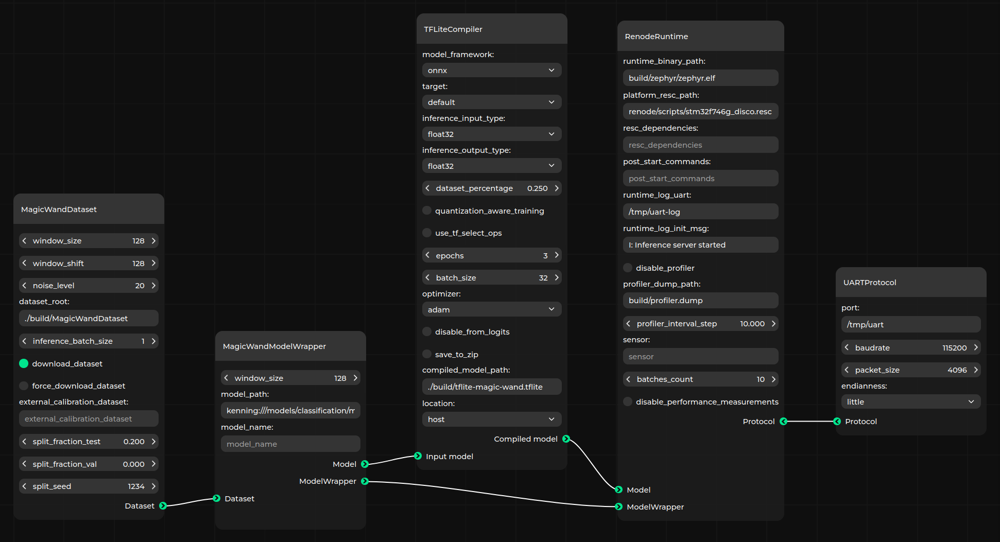
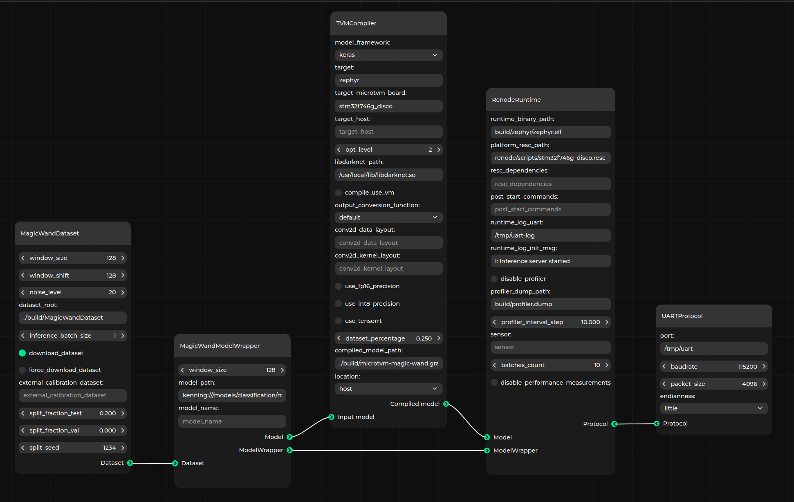

# Evaluating models on hardware using Kenning Zephyr Runtime

This section contains tutorial of evaluating models on microcontrollers using [Kenning Zephyr Runtime](https://github.com/antmicro/kenning-zephyr-runtime) and [Renode](https://renode.io/).

## Preparing the Zephyr environment

First, we need to setup environment for building the runtime.
Start with installing dependencies:

* [Zephyr dependencies](https://docs.zephyrproject.org/latest/develop/getting_started/index.html#install-dependencies)
* `jq`
* `curl`
* `west`
* `CMake`
* `python` with `uv` or `pip`

On Debian-based Linux distributions, the above-listed dependencies can be installed as follows:

```bash
apt update

apt install -y --no-install-recommends ccache curl device-tree-compiler dfu-util file \
  g++-multilib gcc gcc-multilib git jq libmagic1 libsdl2-dev make ninja-build \
  python3-dev python3-setuptools python3-tk python3-wheel python3-venv \
  mono-complete wget xxd xz-utils patch
```

Next, create a Zephyr workspace directory and clone there Kenning Zephyr Runtime repository:
```bash
mkdir -p zephyr-workspace && cd zephyr-workspace
git clone https://github.com/antmicro/kenning-zephyr-runtime.git
cd kenning-zephyr-runtime
```

Then, initialize Zephyr workspace, ensure that latest Zephyr SDK is installed, and install Python dependencies with:

```bash
pip install west
west init -l .
west update
west zephyr-export
pip install --upgrade pip setuptools
pip install -r requirements.txt -r ../zephyr/scripts/requirements-base.txt
west sdk install --toolchains x86_64-zephyr-elf aarch64-zephyr-elf arm-zephyr-eabi riscv64-zephyr-elf
```

Finally, prepare additional Zephyr modules:

```bash
./scripts/prepare_modules.sh
```

## Installing Kenning with Renode support

Evaluating models using Kenning Zephyr Runtime requires [Kenning](https://github.com/antmicro/kenning) with Renode support.
Use `pip` or `uv` to install it:

```bash
pip install "kenning[tvm,tensorflow,reports,renode] @ git+https://github.com/antmicro/kenning.git"
```

To use Renode, either follow [Renode documentation](https://renode.readthedocs.io/en/latest/introduction/installing.html) or use the script:

```bash
source ./scripts/prepare_renode.sh
```

## Building and evaluating Magic Wand model using TFLite backend



Let's build the Kenning Zephyr Runtime with [TFLiteMicro](https://github.com/tensorflow/tflite-micro) as model executor for `stm32f746g_disco` board.
Run:

```bash
west build --board stm32f746g_disco app -- -DEXTRA_CONF_FILE=tflite.conf
west build -t board-repl
```

The built binary can be found in `build/zephyr/zephyr.elf`.

To evaluate the Magic Wand model using built runtime, run:
```bash
kenning optimize test \
    --cfg kenning-scenarios/magic-wand-inference/tflite/renode-auto-stm32f746g.yml \
    --measurements build/zephyr-stm32-tflite-magic-wand.json --verbosity INFO \
    --verbosity INFO
```

The evaluation results would be saved at `build/zephyr-stm32-tflite-magic-wand.json`.

## Building and evaluating Magic Wand model using microTVM backend



Building the Kenning Zephyr Runtime with [microTVM](https://tvm.apache.org/) support for the same board requires changing only `-DEXTRA_CONF_FILE` value.
Run:

```bash
west build --board stm32f746g_disco app -- -DEXTRA_CONF_FILE=tvm.conf
west build -t board-repl
```

And now, as previously, run evaluation using Kenning:
```bash
kenning optimize test \
    --cfg kenning-scenarios/magic-wand-inference/tvm/renode-auto-stm32f746g.yml \
    --measurements build/zephyr-stm32-tvm-magic-wand.json --verbosity INFO \
    --verbosity INFO
```

The evaluation results would be saved at `zephyr-stm32-tvm-magic-wand.json`.

## Comparing the results

To generate comparison report run:

```bash
kenning report \
    --measurements \
      build/zephyr-stm32-tflite-magic-wand.json \
      build/zephyr-stm32-tvm-magic-wand.json \
    --report-path build/zephyr-stm32-tflite-tvm-comparison.md \
    --to-html
```

The HTML version of the report should be saved at `build/zephyr-stm32-tflite-tvm-comparison/zephyr-stm32-tflite-tvm-comparison.html`.

## Collecting ML-aware traces using Zephelin and generating a trace report

Kenning is integrated with Zephelin - a tool for ML-aware tracing of Zephyr applications.
This integration allows for seamless tracing of models tested in Kenning Zephyr Runtime.
As an example, we will collect traces using GDB during inference of Magic Wand model with microTVM on `stm32f746g_disco`.

First, build Kenning Zephyr Runtime with Zephelin configured for GDB tracing:

```bash
west build -p -b stm32f746g_disco app -- -DEXTRA_CONF_FILE="tvm.conf;$(realpath ./zpl.conf);zpl_gdb.conf"
west build -t board-repl
```

Second, install Zephelin's Python dependencies and the [GDB debugger](https://www.sourceware.org/gdb/) with support for multiple architectures:

```bash
pip install -r ../zephelin/requirements.txt
apt install -y gdb-multiarch
```

Then run optimization, inference and report generation:

```bash
kenning optimize test report \
    --cfg kenning-scenarios/magic-wand-inference/tvm/renode-zephelin-gdb-stm32f746g.yml \
    --measurements build/zephelin-zephyr-stm32-tvm-magic-wand.json --verbosity INFO \
    --report-path build/zephelin-zephyr-stm32-tvm.md \
    --to-html
```

:::{note}
Platform parameter `enable_zephelin` needs to be set to `true` (as you can see inside the `kenning-scenarios/zephelin-renode-zephyr-tvm-magic-wand-inference.yml` file),
to enable automatic trace collection by Kenning. For manual trace collection, please refer to [Zephelin documentation](https://antmicro.github.io/zephelin/).
:::
