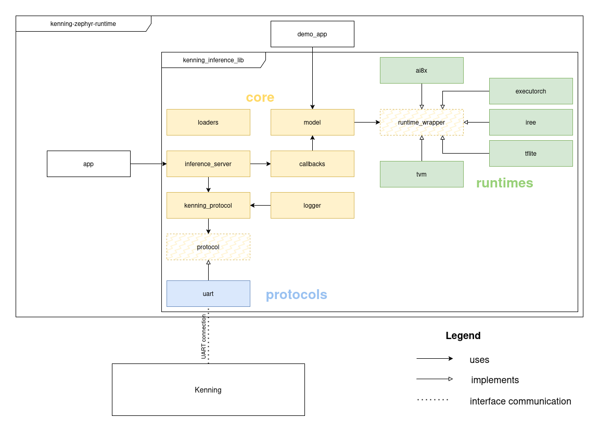

# Kenning Zephyr Runtime

Kenning itself offers multiple implementations of the core [Runtime](runtime-api) class, that enable running model inference and evaluation with multiple frameworks (such as ONNX or TFLite).
However Kenning is a Python Linux application. To run models on platforms, that do not support this stack (such as STM32 microcontrollers) [Kenning Zephyr Runtime](https://github.com/antmicro/kenning-zephyr-runtime/) can be used.

Kenning Zephyr Runtime consists of a [Zephyr RTOS](https://www.zephyrproject.org/) library (`kenning_inference_lib`) and two Zephyr applications using the library: `app` and `demo_app`.
Most of the code is written in C.

- `kenning_inference_lib` provides an implementation of [Kenning Protocol](kenning-protocol) (for communication with Kenning), as well as functions for running ML model inference with the following frameworks (runtimes):
  - [TFLite Micro](https://github.com/tensorflow/tflite-micro) - execution-only version of [TensorFlow](https://www.tensorflow.org/) for microcontrollers
  - microTVM - version of Apache's [TVM](https://tvm.apache.org/) runtime dedicated for small embedded platforms
  - [IREE](https://iree.dev/) - [MLIR](https://mlir.llvm.org/)-based compiler, that leverages [LLVM](https://llvm.org/) to compile ML models to machine code, or to VM-executed bytecode
  - [ExecuTorch](https://docs.pytorch.org/executorch/stable/index.html) - versatile ML inference framework developed by the [PyTorch Foundation](https://pytorch.org/)
  - [ai8x](https://github.com/analogdevicesinc/ai8x-synthesis) - toolkit developed by [Analog Devices](https://www.analog.com/en/index.html) to run ML models on their platforms
- `app` is an application, that uses `kenning_inference_lib` to take inference requests from Kenning over [Kenning Protocol](kenning-protocol) and execute them using the selected framework (runtime)
- `demo_app` is an example application, showcasing how `kenning_inference_lib` can be used without Kenning as a library to run model inference

To check support for various runtimes on various boards, see [Renode Zephyr Dashboard](https://zephyr-dashboard.renode.io/).
It consists of over a dozen tests executed periodically on all platforms supported by Zephyr.
Three of the tests are: `demo_app` with microTVM, `demo_app` with TFLite and `demo_app` with IREE.

Overview of Kenning Zephyr Runtime use-cases:

- Running Kenning evaluation examples - see [instructions on preparing the environment](preparing-the-environment) and then [running a simple `app` example](model-evaluation).
- Running the `demo_app` - see [instructions on preparing the environment](preparing-the-environment) and then [building and running `demo_app`](demo-app).
- Adding support for a new runtime (ML framework) - see [information on `runtime_wrapper`](runtimes) and [`loaders`](model).
- Adding support for Kenning evaluation on a new board  - see [instructions on configuring Kenning Zephyr Runtime for a new board](uart-configuration).
- Using Kenning Zephyr Runtime as a library for model inference - see [`model` API](model).

(kenning-zephyr-runtime-usage)=
## Usage

(preparing-the-environment)=
### Preparing the environment

To use Kenning Zephyr Runtime, first clone the repository:

```bash
mkdir -p zephyr-workspace && cd zephyr-workspace
git clone https://github.com/antmicro/kenning-zephyr-runtime.git
cd kenning-zephyr-runtime
```

Install the following dependencies:
* [Zephyr dependencies](https://docs.zephyrproject.org/latest/develop/getting_started/index.html#install-dependencies)
* `jq`
* `curl`
* `west`
* `CMake`

On Debian Linux and adjacent distributions, it can be done with:

```bash
apt update

apt install -y --no-install-recommends ccache curl device-tree-compiler dfu-util file \
  g++-multilib gcc gcc-multilib git jq libmagic1 libsdl2-dev make ninja-build \
  python3-dev python3-pip python3-setuptools python3-tk python3-wheel python3-venv \
  mono-complete wget xxd xz-utils patch
```

Then, run:

```bash
./scripts/prepare_zephyr_env.sh
source .venv/bin/activate
```

This will:

- Create a Python virtual environment
- Install Python dependencies of Kenning and Kenning Zephyr Runtime
- Create a Zephyr workspace and download all modules
- Install Zephyr SDK, with toolchains for: x86, RISCV-64, ARM and ARM64 (Aarch64)

The script will also detect if [uv](https://docs.astral.sh/uv/concepts/tools/) tool is present in your system and if so, use it instead of pip.
Using uv with Kenning Zephyr Runtime is encouraged for optimal performance.

Alternatively, you can do this manually (for example if you want to install a different set of toolchains):

```
python3 -m venv .venv --system-site-packages
source .venv/bin/activate
pip install pip setuptools west --upgrade
west init -l .
west update
pip install -r requirements.txt -r ../zephyr/scripts/requirements-base.txt
west zephyr-export
west sdk install --toolchains x86_64-zephyr-elf arm-zephyr-eabi riscv64-zephyr-elf aarch64-zephyr-elf
```

or when using uv:

```
uv venv .venv --python=3.11
source .venv/bin/activate
uv pip install pip setuptools west --upgrade
west init -l .
west update
uv pip install -r requirements.txt -r ../zephyr/scripts/requirements-base.txt
west zephyr-export
west sdk install --toolchains x86_64-zephyr-elf arm-zephyr-eabi riscv64-zephyr-elf aarch64-zephyr-elf
```

:::{note}
By default, the Zephyr workspace will be created in one-up directory from the Kenning Zephyr Runtime repository.
Therefore modules will be installed in `../tvm`, `../zephyr` etc.
For that reason it is advised to clone the repository into a dedicated folder (as shown above).
:::

One of the Python dependencies installed will be Kenning.
You can also install Kenning manually, for a different selection of extras.
For example:

```bash
pip install "kenning[tvm,tensorflow,reports,renode] @ git+https://github.com/antmicro/kenning.git"
```

or when using uv:

```
uv pip install "kenning[tvm,tensorflow,reports,renode] @ git+https://github.com/antmicro/kenning.git"
```

Eventually, run:

```bash
./scripts/prepare_modules.sh
```

Some C/C++ dependencies of Kenning Zephyr Runtime are not packaged as Zephyr modules out-of-the-box.
This script will add necessary files to Zephyr and to the modules themselves.
Those files are stored in `modules` directory in Kenning Zephyr Runtime.

(app)=
### Model evaluation with Kenning (using `app`)

(model-evaluation)=
#### Basic evaluation scenario

As an example we will generate a report for a simple [CNN](https://cs231n.github.io/convolutional-networks/) model trained on a Magic Wand dataset (recognizing movements based on accelerometer data), ran with TFlite runtime on `stm32f746g_disco` board.

First, build `app` on `stm32f746g_disco`, using [west](https://docs.zephyrproject.org/latest/develop/west/index.html).
Please note, how we select `tflite.conf` config file to use TFlite - in Zephyr applications the default application config is in `prj.conf` file, but extra configuration files can be specified with `-DEXTRA_CONF_FILE` option.

```bash
west build -p always -b stm32f746g_disco app -- -DEXTRA_CONF_FILE=tflite.conf
```

Option `-p always` will force west to run a clean build. Drop the option to run incremental builds.

Built application can be found at `build/zephyr/zephyr.elf` (`build` is the default build directory).

:::{note}
Due to a version conflict, Python dependencies for building with ExecuTorch runtime (`executorch.conf` configuration file) cannot be installed automatically.
Therefore command `pip install executorch>=0.7.0` (or `uv pip install executorch>=0.7.0` if using uv) has to be ran before building.
:::

We could run the application on a physical `stm32f746g_disco` board, which would require running `west flash` command.
However in this example we will use the [Renode](https://renode.io/) emulator.
For that, we will need to generate a `.repl` file (a board configuration file for Renode - for details, please refer to [Renode documentation](https://renode.readthedocs.io/en/latest/host-integration/arduino.html#configuring-renode)):

```bash
west build -t board-repl
```

This step will need to be repeated every time a clean build is ran or a different board is used.

Before running the simulation we need to install Renode, which can be done with a script:

```bash
source ./scripts/prepare_renode.sh
```

This will:
- Download the latest Renode release.
- Export environmental variables, that will allow Kenning to find Renode (for that reason the script has to be ran with `source` and needs to be re-ran every time a new shell is used).

Finally, we can run Kenning with one of the example [scenarios](json-scenarios) provided with Kenning Zephyr Runtime:

```bash
kenning optimize test report \
    --cfg kenning-scenarios/renode-zephyr-tflite-magic-wand-inference.yml \
    --measurements results.json \
    --report-path reports/stm32-renode-tflite-magic-wand/report.md \
    --to-html
```

This example scenario can be seen below:
```
platform:
  type: ZephyrPlatform
  parameters:
    name: stm32f746g_disco
    simulated: true
    zephyr_build_path: ./build
dataset:
  type: MagicWandDataset
  parameters:
    dataset_root: ./output/MagicWandDataset
model_wrapper:
  type: MagicWandModelWrapper
  parameters:
    model_path: kenning:///models/classification/magic_wand.h5
optimizers:
- type: TFLiteCompiler
  parameters:
    compiled_model_path: ./output/magic-wand.tflite
    inference_input_type: float32
    inference_output_type: float32
```

Notice, how instead of providing a `runtime` for the model, as we would do when running normal Kenning evaluation, we provide a `platform`.

When running this, Kenning will:

- Optimize the model with `TFLiteCompiler`.
- Automatically run Renode simulation of the built app (`simulated: true` option means that Kenning will run Renode simulation automatically).
- Connect over (virtual) UART and send model and data for evaluation.
- Receive evaluation results and save them under `results.json` (as specified with the `--measurements` CLI option).
- Generate a report and save it under `reports/stm32-renode-tflite-magic-wand/`

To run evaluation on a physical board (not one simulated in Renode) we would need to set `simulated` to `false` and provide a path to the correct `UART` port with `uart_port` ([example](https://github.com/antmicro/kenning-zephyr-runtime/blob/main/kenning-scenarios/zephyr-tflite-magic-wand-inference.yml)).

It is also possible to run a standalone Renode simulation manually and have Kenning connect to the existing simulation. To do that you should run:

```
python ./scripts/run_renode.py
```

This script will run a Renode simulation of the application currently at `build/zephyr/zephyr.elf` and mount the UART port at `/tmp/uart`.
You can then run Kenning separately with `platform` parameters: `simulation: false` and `uart_port: /tmp/uart`.
You may run multiple inference sessions without restarting the simulation (just as you would with a physical board).

(runtime-builder)=
#### Automatic building of Kenning Zephyr Runtime

Kenning itself can build Kenning Zephyr Runtime and generate the `.repl` file, allowing you to skip those steps.
To do that, you need to add `runtime_builder` to the scenario, as shown below:

```
platform:
  type: ZephyrPlatform
  parameters:
    name: stm32f746g_disco
    simulated: true
dataset:
  type: MagicWandDataset
  parameters:
    dataset_root: ./output/MagicWandDataset
model_wrapper:
  type: MagicWandModelWrapper
  parameters:
    model_path: kenning:///models/classification/magic_wand.h5
runtime_builder:
  type: ZephyrRuntimeBuilder
  parameters:
    workspace: .
    run_west_update: false
    output_path: ./output
    extra_targets: [board-repl]
optimizers:
- type: TFLiteCompiler
  parameters:
    compiled_model_path: ./output/magic-wand.tflite
    inference_input_type: float32
    inference_output_type: float32
```

This example scenario can be ran without first building the `app`:

```bash
kenning optimize test report \
    --cfg kenning-scenarios/renode-zephyr-auto-tflite-magic-wand-inference.yml \
    --measurements results.json \
    --report-path reports/stm32-renode-tflite-magic-wand/report.md \
    --to-html
```

#### Tracing with Zephelin

Kenning and Kenning Zephyr Runtime are integrated with [Zephelin](https://antmicro.github.io/zephelin/) - [Antmicro](https://antmicro.com/)'s tool for ML-aware tracing in Zephyr RTOS.
You can use that tool to generate a report with detailed information about your model's time and memory performance, broken down into individual layers.
Zephelin allows for collecting traces either through an UART port or with GDB debugger.
Zephelin supports TVM and TFLite.

First, install Zephelin's Python dependencies:

```
pip install -r ../zephelin/requirements.txt
```

Then, you need to build Kenning Zephyr Runtime with Zephelin included, by adding extra configuration files.

For tracing with GDB:
```
west build -p -b stm32f746g_disco app -- -DEXTRA_CONF_FILE="tvm.conf;tvm_zpl.conf;zpl_gdb.conf"
```

For tracing with UART:
```
west build -p -b stm32f746g_disco app -- -DEXTRA_CONF_FILE="tvm.conf;tvm_zpl.conf;zpl_uart.conf"
```

For GDB tracing, you also need to install GDB with support for multiple architectures. On Linux Debian it can be done with:

```
apt install -y gdb-multiarch
```

Finally, you can run optimization, testing and report generation, using a scenario with platform parameter `enable_zephelin` set to `true`:

```
platform:
  type: ZephyrPlatform
  parameters:
    name: stm32f746g_disco
    simulated: true
    enable_zephelin: true
    zephyr_build_path: ./build/

model_wrapper:
  type: MagicWandModelWrapper
  parameters:
    model_path: kenning:///models/classification/magic_wand.h5

dataset:
  type: MagicWandDataset
  parameters:
    dataset_root: ./output/MagicWandDataset

optimizers:
  - type: TVMCompiler
    parameters:
      compiled_model_path: ./build/compiled-model-magic-wand.graph_data
```

Since we will be running Kenning Zephyr Runtime in a Renode simulation, we need to prepare a `.repl` file:

```
west build -t board-repl
```

To include traces in the report, you must specify it with `--report-types` option, as shown below:

```
kenning optimize test report \
    --cfg kenning-scenarios/zephelin-renode-zephyr-tvm-magic-wand-inference.yml \
    --measurements build/zephelin-zephyr-stm32-tvm-magic-wand.json --verbosity INFO \
    --report-path build/zephelin-zephyr-stm32-tvm.md \
    --report-types zephyr_traces renode_stats performance classification \
    --to-html
```

A dedicated report section (`zephyr_traces`) will be generated, with an interactive window allowing you to analyze the traces with Zephelin Trace Viewer.

#### Using dynamically linked runtime for evaluation

In this example, we will build Kenning Zephyr Runtime and microTVM separately.
Then Kenning will send built microTVM to Kenning Zephyr Runtime over Kenning Protocol and it will be dynamically linked with [Zephyr's LLEXT subsystem](https://docs.zephyrproject.org/latest/services/llext/index.html) as en extension.

First, build Kenning Zephyr Runtime with LLEXT:

```bash
west build -p always -b stm32f746g_disco app -- -DEXTRA_CONF_FILE=llext.conf
```

If running with Renode, generate the `.repl` file:

```bash
west build -t board-repl
```

Then, build the extension:

```bash
west build app -t llext-tvm -- -DEXTRA_CONF_FILE="llext.conf;llext_tvm.conf"
```

It will be placed in `build/llext` directory.

Evaluation can be ran with the following scenario:

```
platform:
  type: ZephyrPlatform
  parameters:
    name: stm32f746g_disco
    simulated: true
    zephyr_build_path: ./build
    llext_binary_path: ./build/llext/tvm.llext
dataset:
  type: MagicWandDataset
  parameters:
    dataset_root: ./output/MagicWandDataset
model_wrapper:
  type: MagicWandModelWrapper
  parameters:
    model_path: kenning:///models/classification/magic_wand.h5
optimizers:
- type: TVMCompiler
  parameters:
    compiled_model_path: ./output/microtvm-magic-wand.graph_data
```

You can see, that `llext_binary_path` was parameter added to `platform`.

```bash
kenning optimize test report \
    --cfg kenning-scenarios/renode-zephyr-tvm-llext-magic-wand-inference.yml \
    --measurements results.json --verbosity INFO \
    --report-path reports/stm32-renode-tvm-llext-magic-wand/report.md \
    --to-html \
    --verbosity INFO
```

LLEXT is also compatible with [runtime building by Kenning](runtime-builder).

(uart-configuration)=
#### UART configuration - adding support for a new board

By default all Zephyr boards have 1 UART port dedicated to Zephyr console.
Kenning Zephyr Runtime will print welcome message and logs to that console - when running Renode simulation Kenning will wait for the welcome message on that UART, before sending any requests (to make sure Kenning Zephyr Runtime booted successfully).

Another UART port is needed for two-way communication with Kenning over Kenning Protocol (sending model data, inputs and outputs).
To inform the app which UART port to use for that purpose we assign `kcomms` alias to the port, using [Zephyr devicetree](https://docs.zephyrproject.org/latest/build/dts/howtos.html).
Overlay files adding the alias for various boards can be found in `app/boards`, for example [the overlay file for `stm32f746g_disco`](https://github.com/antmicro/kenning-zephyr-runtime/blob/main/app/boards/stm32f746g_disco.overlay).

To run Kenning evaluation with `app` on any given board, such a file has to be created.
Overlay files should be placed at `app/boards/<board_name>.overlay` (where `<board_name>` is the name of the board in Zephyr, except if the board name contains any `/` characters, they should be changed to `_`) for west to find and use them.

On some boards only one UART port is available, then `kcomms` can be set to the same port as Zephyr console.
However in such a case printing logs and the welcome message to the console has to be disabled, by adding to the configuration file (`app/prj.conf` or another config file added with `-DEXTRA_CONF_FILE=tflite.conf`):

```
CONFIG_LOG_BACKEND_UART=n
CONFIG_BOOT_BANNER=n
CONFIG_PRINTK=n
```

Kenning will detect, that `kcomms` is set to the same port as Zephyr console and will wait for a set amount of time before sending any requests, instead of waiting for the welcome message.

:::{note}
Kenning Zephyr Runtime also sends logs through Kenning Protocol, aside from printing them. Therefore after printing logs to the UART console is disabled, Kenning will still receive and display them.
:::

Some boards may also require additional configuration.
Those should be placed at `app/boards/<board_name>.conf`.

(demo-app)=
### Building and running the `demo_app`

The `demo_app` is an example on how to use `kenning_inference_lib` for model inference.
In can also be used for easy debugging of various runtimes.

#### Building

The example below shows how to build `demo_app` with IREE runtime in embedded_elf mode and run it with Renode emulator.

Please note, how we select `iree_embedded_elf.conf` config file to use IREE in embedded_elf mode - in Zephyr applications the default application config is in `prj.conf` file, but extra configuration files can be specified with `-DEXTRA_CONF_FILE` option.

```bash
west build -p always -b b_u585i_iot02a demo_app -- -DEXTRA_CONF_FILE=iree_embedded_elf.conf
```

Option `-p always` will force west to run a clean build.
Drop the option to run incremental builds.

Built application can be found at `build/zephyr/zephyr.elf` (`build` is the default build directory).

:::{note}
Due to a version conflict, Python dependencies for building with ExecuTorch runtime (`executorch.conf` configuration file) cannot be installed automatically.
Therefore command `pip install executorch>=0.7.0` (or `uv pip install executorch>=0.7.0` if using uv) has to be ran before building.
:::

To run a Renode simulation, we also need to generate a [`.repl` file](https://renode.readthedocs.io/en/latest/host-integration/arduino.html#configuring-renode):

```bash
west build -t board-repl
```

#### Running

Before running the simulation, we need to install Renode, which can be done with a script:

```bash
source ./scripts/prepare_renode.sh
```

This step has to be repeated every time a new shell is used, since the script exports environmental variables.

Finally, we can use a Python script to run the demo:

```bash
python ./scripts/run_renode.py
```

The script will automatically capture output from the Zephyr UART console and print it to the terminal.
Output should contain classification results for 10 inferences, along with some inference statistics.

Example:

```
*** Booting Zephyr OS build cb93f97bd632 ***
I: model output: [wing: 213.957581, ring: 80.423096, slope: 113.229347, negative: 158.669266]
I: model output: [wing: 162.148727, ring: 140.959763, slope: 149.957077, negative: 236.156738]
I: model output: [wing: 188.821167, ring: 250.954254, slope: 465.087280, negative: 329.155548]
I: model output: [wing: 338.350281, ring: 124.087746, slope: 176.398376, negative: 253.115128]
I: model output: [wing: -4.008125, ring: 17.447971, slope: -7.546308, negative: 11.472966]
I: model output: [wing: 92.145882, ring: 120.856918, slope: 199.117325, negative: 148.276291]
I: model output: [wing: 48.781986, ring: -10.816504, slope: 2.117259, negative: 8.108253]
I: model output: [wing: 409.882965, ring: 152.557022, slope: 218.346588, negative: 307.647247]
I: model output: [wing: 131.864807, ring: 56.820183, slope: 77.920113, negative: 98.029968]
I: model output: [wing: 111.868919, ring: 157.771622, slope: 303.319855, negative: 198.856461]
I: inference session statistics:
I:      total inference time: 5644 ms
I:      inference time per batch: 564 ms
I:      device_bytes_allocated: 256032
I:      device_bytes_freed: 224144
I:      device_bytes_peak: 54288
I:      host_bytes_allocated: 32384
I:      host_bytes_freed: 30848
I:      host_bytes_peak: 17024
I:      total_allocated: 473962
I:      total_freed: 369068
I:      peak_allocated: 132518
```

#### Debugging

To run with a debug server, use `--debug` option:

```
python ./scripts/run_renode.py --debug
```

A [GDB](https://www.sourceware.org/gdb/) server will be started on port `3333`.
Connection can be made by running:

```
target remote :3333
```

Debug symbols can be loaded from the built binary: `build/zephyr/zephyr.elf`.

Please refer to [GDB documentation](https://sourceware.org/gdb/current/onlinedocs/gdb.html/) for further instructions on how to debug with GDB.

:::{note}
Please remember to use version of GDB compatible with the architecture of the selected board.
:::

### Building with artificially increased memory size for simulation

In some cases we would like to evaluate a model that won't fit in the board memory together with Kenning Zephyr Runtime, for example when target application is smaller than Kenning Zephyr Runtime.
For such cases, there is a west target called increase-memory.

To do that, run normal build first. For example:

```
west build -p always -b 96b_nitrogen demo_app -- -DEXTRA_CONF_FILE=tvm.conf
```

It should fail, due to insufficient memory. Then you can run:

```
west build -t increase-memory -- -DCONFIG_KENNING_INCREASE_MEMORY_SIZE=2048
```

This will generate board overlay with increased memory and save it in `<application>/boards/<board_name>_increased_memory.overlay`.
Example overlay looks like this:

```
&sram0 {
    reg = <0x20000000 0x200000>;
};
```

The new overlay file will remain there even after clean builds, so this step does not need to be repeated.
To use the overlay, run the build with `-CONFIG_KENNING_INCREASE_MEMORY=y` option:

```
west build -p always -b 96b_nitrogen demo_app -- -DEXTRA_CONF_FILE=tvm.conf -DCONFIG_KENNING_INCREASE_MEMORY=y
```

From here you may proceed normally.
This option is available for both `app` and `demo_app`.

:::{note}
Increased memory will only work in a Renode simulation.
:::


## General code structure

Relationships between Kenning and various elements of Kenning Zephyr Runtime, as well as internal structure of `kenning_inference_lib` is displayed on the diagram below.


(runtimes)=
### Runtimes (runtime_wrapper and it's implementations, adding a runtime)

`runtime_wrapper` serves as a common interface for various ML frameworks (runtimes).

`runtime_wrapper.h` is a header file, that contains the following function declarations:

- `runtime_init` - Initialize the runtime (framework).
- `runtime_init_weights` - Load an ML model.
- `runtime_init_input` - Load input into the model.
- `runtime_run_model` - Run inference.
- `runtime_run_model_bench` - Run inference with a time benchmark (results can be downloaded with `runtime_get_statistics`).
- `runtime_get_model_output` - Get output from the model (after inference).
- `runtime_get_statistics` - Get statistics (since the beginning of the current inference session, so since `runtime_init` was last called) - that includes inference time and possibly other framework-dependent statistics.
- `runtime_deinit` - De-initialize the runtime.

To add a new framework (runtime) to Kenning Zephyr Runtime, a source file needs to be created that implements all of these functions ([example](https://github.com/antmicro/kenning-zephyr-runtime/blob/main/lib/kenning_inference_lib/runtimes/tvm/tvm.c)), as well as creates loaders for model and model input (for details see the [section about loaders](model))

Implementation is selected at build time, by [linking the correct files with CMake](https://github.com/antmicro/kenning-zephyr-runtime/blob/main/lib/kenning_inference_lib/CMakeLists.txt).

Kenning Zephyr Runtime also supports dynamic linking of runtimes through [Zephyr's LLEXT subsystem](https://docs.zephyrproject.org/latest/services/llext/index.html).

(model)=
### The model API and loaders

The `model` is an abstraction over `runtime_wrapper` and handles tasks such as data validation.
It also stores model metadata (such as shapes of the model's inputs and outputs), which it makes available to `runtime_wrapper` implementations.

It declares and implements functions such as `model_load_input`, `model_run` or `model_load_struct` (for loading model metadata).
For all function declarations see [model.h](https://github.com/antmicro/kenning-zephyr-runtime/blob/main/include/kenning_inference_lib/core/model.h).

All `model` functions, that take data (model, input or model metadata) as input have 2 versions:

- Loading data from an array (`model_load_struct`, `model_load_weights`, `model_load_input`)
- Loading data using `loaders` (`model_load_struct_from_loader`, `model_load_weights_from_loader`, `model_load_input_from_loader`)

`loaders` are a mechanism for loading data without large temporary buffers, therefore saving both execution time and memory.

For example, assume we have a model with input size of 2kB, which we receive byte-by-byte over a serial interface.
To load the input with `model_load_input` (which takes a pointer to an array and array size as arguments) we would need to create a 2kB temporary buffer to store the data arriving over the interface and only call `model_load_input` after all of the data has been received.

To save that memory we can use `loaders` - structs stored in a global table (`g_ldr_tables`), that contain:

- pointer to the destination buffer (the final place, where the data is supposed to be loaded - in case of model input it would be an array in the `runtime_wrapper` implementation of the selected framework)
- number of bytes written
- maximum number of bytes, that can be written
- state of the loader
- pointer to a function for loading the data
- pointer to a function for resetting the loader

Functions for loading data and resetting have default implementations and a macro is defined in `loaders.h` to create an instance of a loader with default functions at the given address and with the given size: `MSG_LOADER_BUF(_addr, _max_size)`.
However a loader with custom implementations of these functions can also be created, to define a custom behaviour.

Every implementation of `runtime_wrapper.h` creates it's own loaders in `runtime_init` for model and model input.
Pointers to these loaders should be placed in `g_ldr_tables` at indexes `[1][LOADER_TYPE_MODEL]` for model and `[1][LOADER_TYPE_DATA]` for input.

Going back to our example - to avoid using a 2kB temporary buffer we can receive the data in batches, saving it into a smaller buffer and repeatedly calling `g_ldr_ tables[1][LOADER_TYPE_DATA]->save` for each batch, then finally calling `model_load_input_from_loader`.
An example of that use case can be seen in the [`receive_message_payload` function in `kenning_protocol.c`](https://github.com/antmicro/kenning-zephyr-runtime/blob/aefffa8969e4b79b10de8a05085143144eca974b/lib/kenning_inference_lib/core/kenning_protocol.c#L56).

(kcomms)=
### Communication stack

The communication stack consists of 2 abstraction layers:

- `protocol` - lower layer, provides functions `protocol_init`, `protocol_read_data` and `protocol_write_data`, allows for sending raw bytes over an interface
- `kenning_protocol` - implementation of [Kenning Protocol](kenning-protocol), using the data link provided by `protocol`, provides functions `protocol_transmit` and `protocol_listen` (requests are not supported). `protocol_listen` uses `loaders` to receive message payload, it takes as a callback function that returns the correct callback based on message type.

Header file [`protocol.h`](https://github.com/antmicro/kenning-zephyr-runtime/blob/main/include/kenning_inference_lib/core/protocol.h) only serves as an interface and declares the functions.
Function are defined by implementations.
Currently 1 implementation is provided ([`uart.c`](https://github.com/antmicro/kenning-zephyr-runtime/blob/main/lib/kenning_inference_lib/protocols/uart.c)).

(inference-server)=
### Inference server and callbacks

`inference_server` provides functions: `init_server`, `wait_for_protocol_event` and `handle_protocol_event`.

`wait_for_protocol_event` receives a request from Kenning by calling `protocol_listen`, while `handle_protocol_event` calls the correct callback function from `callbacks` (selected based on message type) and sends response to the request based on on values returned by the callback.

Callback functions from `callbacks` translate requests from Kenning to proper actions by calling functions from `model`.
For example [`output_callback`](https://github.com/antmicro/kenning-zephyr-runtime/blob/aefffa8969e4b79b10de8a05085143144eca974b/lib/kenning_inference_lib/core/callbacks.c#L179) calls `model_get_output`.

(logger)=
### Logger

Kenning Zephyr Runtime uses built-in logging framework from Zephyr RTOS.
However it defines it's own [logging backend](https://docs.zephyrproject.org/latest/services/logging/index.html#logging-backends) to send log messages back to Kenning over [Kenning Protocol](kenning-protocol).
